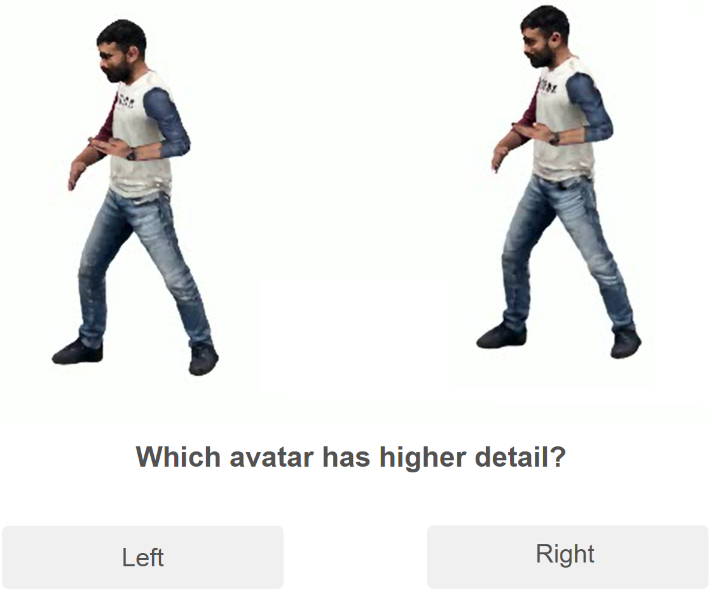

Hi, this is Yinghan Xu (徐英瀚). I am currently a Ph.D. student at the [Graphics and Vision Research Group](https://gv2.scss.tcd.ie/), Trinity College Dublin, supervised by [John Dingliana](https://www.scss.tcd.ie/John.Dingliana/).

My research interests lie in **human-centric 3D vision**, including volumetric video dataset, human reconstruction, motion capture, and avatar generation. Currently, I am focusing on realistic garment reconstruction and rendering using the 3D Gaussian splatting technique.

I earned my Master's degree in Interactive Media Technology from Trinity College Dublin in 2017, where I was supervised by [John Dingliana](https://www.scss.tcd.ie/John.Dingliana/). Before starting my Ph.D. program, I worked as a Computer Vision Engineer at [Mobvoi](https://www.mobvoi.com/) and [STEPVR](https://stepvr.io/) in Beijing, China. My work focused on developing monocular and multiple-view camera motion capture systems.

## Research

<table style="width:100%;border:none;border-spacing:0px;border-collapse:separate;margin-right:auto;margin-left:auto;font-size: large">
<tr>
<td style="padding:20px;width:30%;vertical-align:middle;border:none" align="center">

</td>
<td style="padding:20px;width:70%;vertical-align:middle;border: none" align="left">
<b>Evaluating CrowdSplat: Perceived Level of Detail for Gaussian Crowds</b> 
Xiaohan Sun*, <b>Yinghan Xu</b>*, John Dingliana, Carol O’Sullivan (*=equal contribution) 
<i>IEEE Virtual Reality (workshop paper), 2025</i> 
<a href="https://bigmmgz.github.io/CrowdSplat/"><i class="fas fa-fw fa-globe"></i>Projectpage</a> /
<a href="https://arxiv.org/abs/2501.17085"><i class="fas fa-fw fa-file-pdf"></i>Paper</a> /
<a href=""><i class="fas fa-fw fa-video"></i>Video</a>
</td>
</tr>
</table>

---

<table style="width:100%;border:none;border-spacing:0px;border-collapse:separate;margin-right:auto;margin-left:auto;font-size: large">
<tr>
<td style="padding:20px;width:30%;vertical-align:middle;border:none" align="center">
<video width="100%" playsinline="" autoplay="autoplay" loop="loop" preload="" muted="">
  <source src="../images/CrowdSplat.mp4" type="video/mp4">
</video>
</td>
<td style="padding:20px;width:70%;vertical-align:middle;border: none" align="left">
<b>CrowdSplat: Exploring Gaussian Splatting For Crowd Rendering</b> 
Xiaohan Sun*, <b>Yinghan Xu</b>*, John Dingliana, Carol O’Sullivan (*=equal contribution) 
<i>Irish Machine Vision and Image Processing Conference (<b>IMVIP</b> short paper), 2024</i> 
<a href="https://bigmmgz.github.io/CrowdSplat/"><i class="fas fa-fw fa-globe"></i>Projectpage</a> /
<a href="https://arxiv.org/abs/2501.17792"><i class="fas fa-fw fa-file-pdf"></i>Paper</a> /
<a href=""><i class="fas fa-fw fa-video"></i>Video</a> 
</td>
</tr>
</table>

---
